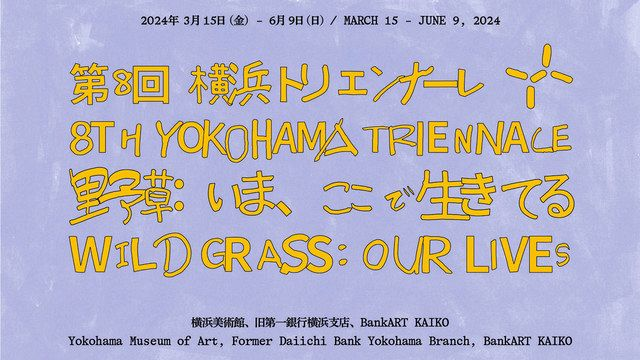

フライヤーに使う文字の動きを試してみていた。こうやってぴょんぴょん踊っている文字が、フライヤーの中に何箇所かあると面白そう。

[Untitled](https://www.notion.so/9e709b0ce36d4ce1b5fae14a96920e19) さんの、横浜トリエンナーレのグラフィックもところどころ動きがあって可愛かったな

ところで、人間の「色」についての認知って面白いなって思う。今回のスケッチをみて、「何色だった？」と聞けば、十中八九「赤」って答えるんじゃないかな。でも、比率で言うと黒と赤が半々でアニメーションになっている。

なんでだろう。「黒」に対する、私たちの認知が関係しているのかもしれない。私たちが黒を「色」ではなく「無」として捉えられているのなら、配分としては同じ2色でも、赤の方が優位に立つ。

時間の変化を伴う表現において、こんなふうに色の扱い方がちょっと考え方が違うのが面白い。Whateverのサイトも白黒だけど、余韻として心に残る色はカラフルだもんね。

[https://whatever.co/ja/](https://whatever.co/ja/)
